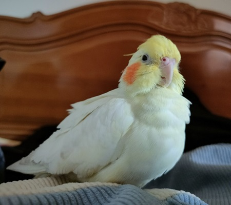
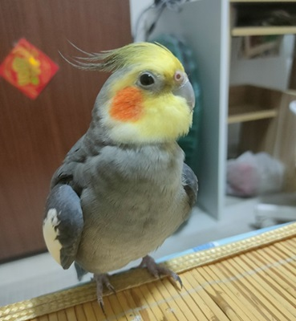

### Hi, I am miyan

I'm a C++ and Python developer.

[Blog](https://blog.miyan.site)

### Open Source

My main open-source contributions are to
[microsoft/vcpkg](https://github.com/microsoft/vcpkg) and
[zenustech/zeno](https://github.com/zenustech/zeno).

I have also submitted small fixes to projects such as
[alibaba/yalantinglibs](https://github.com/alibaba/yalantinglibs)
and other open-source repositories.

I have two parrots and I am very happy to share them with you.

  
  

### GitHub Stats

